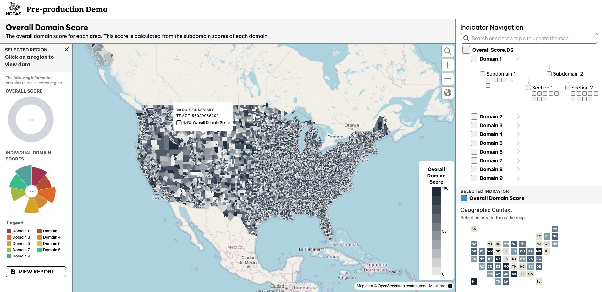

# Wildfire Vulnerability Awareness Visualization - Front-End

Front-end for a website to visualize wildfire vulnerability, built as a volunteer project for NCEAS. The purpose of this project is to visualize and communicate data related to wildfire vulnerability.

### Project Status

The current version of the website uses placeholder data. Once real data is provided by NCEAS, which is expected to be available by the end of 2025, the website will be updated with accurate labels and data visualizations.

### Contribution

This project was developed as a volunteer effort in collaboration with NCEAS. Contributions are welcome; please submit a pull request or open an issue if you have suggestions or improvements.

### Future Updates

Expect significant updates in 2025 when the final dataset is released by NCEAS. Until then, the current implementation may undergo incremental improvements.

## Getting Started

### Install

```bash
npm install
```

Serve with hot reload at <http://localhost:5173>.

```bash
npm run dev
```

### Typecheck

```bash
npm run typecheck
```

### Build

```bash
npm run build
```

## License

This project is licensed under the MIT License.
